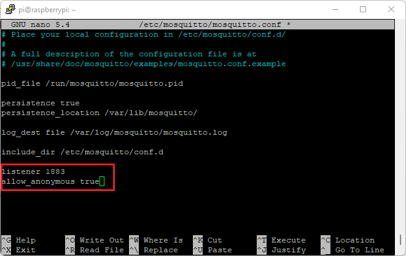
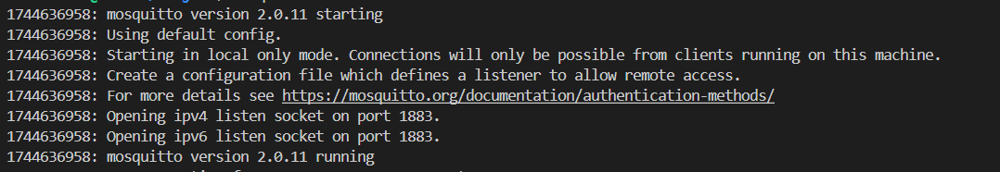
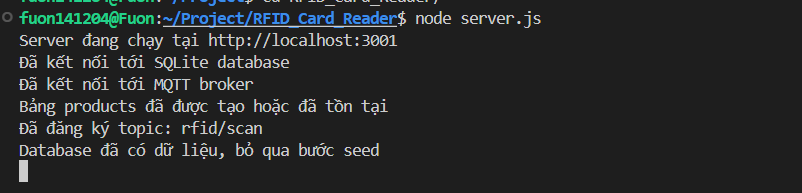

# RFID_Card_Reader Cách cài đặt phần mềm

## Yêu cầu:
- Thiết bị có Nodejs, NPM, Mosquitto version mới nhất, dùng lệnh sau để tải:
  + **Nodejs**: 
    ```
    curl -fsSL https://deb.nodesource.com/setup_20.x | sudo -E bash -
    sudo apt install -y nodejs npm
    sudo npm install -g npm@latest
    ```
  + **Mosquitto MQTT Broker**: 
    ```
    sudo apt install mosquitto mosquitto-clients
    ```
- Port 1883 của thiết bị phải được cấu hình để chấp nhận cả những message ở các thiết bị ngoài nữa, cách làm như sau:
  + Gõ lệnh `sudo nano /etc/mosquitto/mosquitto.conf`
  + Copy lại 2 dòng dướii vào file text mosquitto.conf giống như trong ảnh dưới đây:
    ```
    listener 1883
    allow_anonymous true
    ```
    
  + Ấn tổ hợp phím Ctrl+O để lưu lại, sau đó ấn Enter rồi tổ hợp phím Ctrl+X.
  + Gõ lệnh **sudo systemctl restart mosquitto** để hệ thống nhận cấu hình.
- Config để đầu đọc thẻ có cấu trúc JSON như sau:
  ```json
  {
    "Type": "6C",
    "EPC": "0000000000001000",
    "TID": "E28068942000402C14A1F91A",
    "UserData": "10005466",
    "ReservedData": "",
    "Totalcount": 1,
    "RSSI_db": 0.00
  }
  ```
  trong đó UserData sẽ là trường để lưu SKU của sản phẩm cần thanh toán, việc này cần bên thiết bị tự config cho thẻ RFID.
- Đảm bảo phần cứng của thiết bị đọc đã có thư viện MQTTnet.

## 1. Setup Server
1. Vào thư mục RFID_Card_Reader (Thư mục con bên trong)
2. Gõ lệnh `npm install` để giải nén thư viện.
3. Xác nhận lại Mosquitto đã chạy bằng cách dùng lệnh **mosquitto -v**, nếu có thông báo sau là đã thành công
   
   
   
   (Trong trường hợp thấy thông báo là port 1883 đã bị chiếm dụng thì có nghĩa là Mosquitto đã chạy từ trước rồi)
4. Chạy lệnh `node server.js` để chạy code, hiển thị ra thông báo sau là thành công:
   
   

## 2. Setup Client
1. Vào thư mục Web_GUI (Thư mục con bên trong)
2. Gõ lệnh `npm install` để giải nén thư viện.
3. Gõ lệnh `sudo npm install -g serve`
4. Gõ lệnh `npm run build` để build code (phần này sẽ tốn từ 10-30s)
5. Gõ lệnh `serve -d dist` để chạy code đã build được
6. Truy cập vào link http://localhost:3000 để xác nhận web đã chạy ổn

## 3. Setup cho phần đầu đọc thẻ RFID 
1. Trong phần code xuất ra định dạng dữ liệu của máy, cần thêm đoạn code trong thư mục MqttPublisherTest vào
   
   Lưu ý: đọc kĩ comment trong code để tránh sai sót
2. Ở phần code xuất dữ liệu của thiết bị, gọi hàm ra và thay tham số như trong comment của code là được.